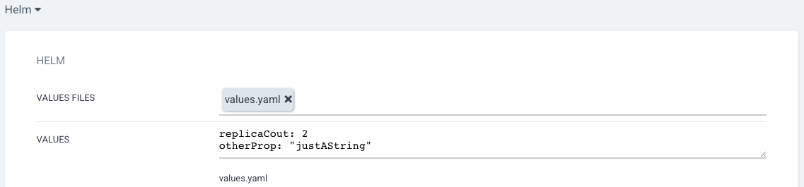
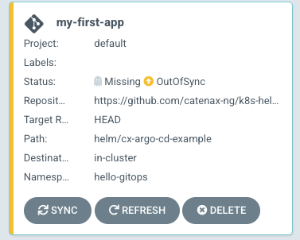

This guide is a small "how-to" about deploying applications with ArgoCD.
Following prerequisites have to be met:

- You need to be member of the [catenax-ng GitHub organization](https://github.com/catenax-ng) and
  a [product team](https://github.com/orgs/catenax-ng/teams)
- Your application's docker images need to be accessible
  - as public [package on GitHub](https://github.com/orgs/catenax-ng/packages) ...
  - or on _cxtsiacr.azurecr.io_ -> not recommended, since no scans can be done on these images
  - or as private [package on GitHub](https://github.com/orgs/catenax-ng/packages) -> Does not work yet. Pull secrets
    have to be provided
- If your GitHub repository is set to private, you first have to process the steps documented
  here: [prepare for private repos](how-to-prepare-a-private-repo)
- An ArgoCD project needs to be created by the DevSecOps team for you.

If these prerequisites are met, you can log in to ArgoCD with your GitHub account
here: [https://argo.demo.catena-x.net/](https://argo.demo.catena-x.net/applications)

## Specify application metadata

After logging in to ArgoCDs UI, you'll see an overview of all already existing Applications. To create a new one, click
the
_NEW APP_ button on the top left. You'll need to choose an application name, which is used to display the application on
ArgoCD's application overview. Also, you have to select the project that was created for your team, since this will be
the
only one that your user has privileges for to create applications. The following example shows, how the UI for creating
an
application looks like:


Beside application name and project, the attribute _sync policy_ is interesting to choose carefully. There are two
options
_Manual_ and _Automatic_. The _Manual_ sync policy means, that you are in full control of when kubernetes resources you
defined
in your GitHub repository are being created. _Automatic_ on the other hand tells ArgoCD to watch your Git repository.
On a regular basis, it checks for changes in the git history and will auto-apply the resources if there are any.

## Specify Git repository URL containing your helm chart

Scrolling to the next section of the _NEW APP_ dialog, you'll find the source attributes. This is where you define the
URL to your Git repository and also the revision. The revision is usually set to _HEAD_, since you want to deploy the
latest
version of your application. You could also choose a specific branch or even a specific tag, when you change the
dropdown at the end of the revision row from _Branches_ to _Tags_. This option can be useful for integration
environments,
where you want to provide other teams with specific stable versions of your app.

> __HINT:__ If you are using private repositories and cannot set it to public, get in contact with the DevSecOps team,
> and we will
> configure repository access for ArgoCD


We highly encourage you, to specify your application deployments as a helm chart. Thereby the repository and path
combination
should point to the location of your helm chart.
ArgoCD also supports you by scanning the repository once you entered the repository URL and auto-suggests a path with
valid deployment specifications.

## Specify destination namespace

The next section of settings is about the destination. The destination is the kubernetes cluster and namespace, that
ArgoCD
should deploy your application to. On Hotel Budapest you are only allowed to deploy applications to the cluster, ArgoCD
is running on.
To specify that cluster, choose ```https://kubernetes.default.svc``` as the cluster URL.

As namespace, you need to specify one, that is assigned to your project that you selected previously in the application
metadata.
Each product team usually has one project assigned and each project is allowed to use one namespace. The name of the
namespace
is usually ```product-<team-name>```.

> If you are unsure, what your assigned namespace is, you can either ask the DevSecOps team, or look at ArgoCDs Setting>
> Projects
> page. There you will find your project and the associated namespaces.


## Specify helm values for your deployment

The last section, when creating an application contains deployment specific settings. If you pointed ArgoCD to a
directory
containing a helm chart (as we encourage you to), you will be able to specify the values.yaml file to use,
or even in-place values, like in the following screenshot.



Typically, you would want a specific values.yaml file named like ```values-<env-name>.yaml``` that overwrites just the
environment specifics and select both, the ```values.yaml``` and the ```values-<env-name>.yaml``` files as values files
in ArgoCD.

If you specified all the settings, you can create the application, by clicking the _Create_ button on the top of the new
app dialog.

## Sync your application resources

After app creation, you'll find your application with a yellow bar and the status 'OutOfSync' on ArgoCDs application
overview.



By clicking the 'Sync' button, you can tell ArgoCD to create all the kubernetes resources defined in your GitHub
repository.
This process can take a while. If successful, you'll see the application turning from yellow and OutOfSync to
green and Synced. You can also click on the application to open the details page.
This will show you a graph of all the resource created.

Clicking on one of the nodes will provide you with resource type specific features like for example logs for pods.
