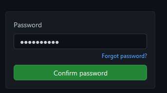
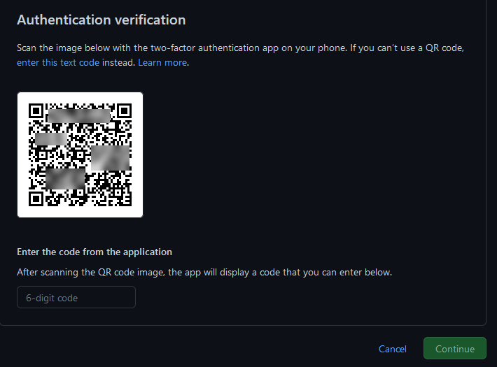
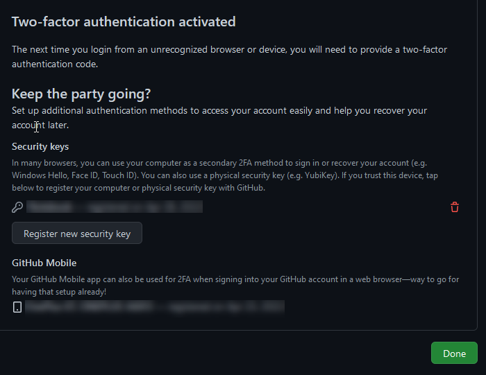

:::caution 2FA usage will be mandatory
Starting Friday, 2022-05-20, the 2 Factor Authentication will be set mandatory for every member in the Catena-X NG organization in Github
:::

## What is 2FA and why do we need this?

2FA stands for [Two-Factor Authentication](https://en.wikipedia.org/wiki/Multi-factor_authentication) and means that beside one unique _thing_ which verifies that you are you, a second one is added:

Typically, the first factor is your password and a second one can be an SMS code, RSA Token (typically used in companies for VPN), Tan Apps (for online banking) or authenticator apps on your phone which show a new 5-7 digit number every minute.

Loosing a password is very easy and can be achieved over the internet/remote. When you reuse a password it could be leaked by a data breach from a different service. You might have written it down or shared it by accident. It could also be that you get tricked in entering your password in an unsecured webpage.

Whatever the attacker tries to get your password, with 2FA they also now need physical access to you which makes those types of attacks much harder.

Especially when we write code, security is a very critical factor as your code will run inside other companies. Therefore we enforce 2FA on Github.com.

## How to activate 2FA in GitHub for your account

- open GitHub, login and go to your personal settings by clicking on the avatar in the upper right corner of GitHub
- Choose "_Settings_"
- click "_Password and authentication_" in the menue on the left hand side
- In section "_Two-factor authentication_" click on the green button "_Enable two-factor-authentication_"

  

- Confirm with your GitHub password

  

- Select the method to use for your second factor ("Set up using an app" is preferred)

  

- Set up a new account with your Authenticator App as described, or follow the other description depending on the hard-/software or other options you have, e.g. Authenticator App

  

- Download and save your recovery codes (if the chosen option shows them)

  

- Done, or setup additional authentication methods

  

## Tips for using 2FA

:::tip
This is a personal recommendation from us; Feel free to read this section.
:::

2FA is a relatively easy way of making your own data more secure. Plenty of data leaks happened in the last few years and our email accounts have lots of security relevant information (personal data and recovery emails).

The [FIDO Alliance](https://en.wikipedia.org/wiki/FIDO_Alliance) was created 2013 to ["help reduce the world’s over-reliance on passwords"](https://envzone.com/why-big-tech-is-striving-for-the-world-without-password/). Out of this efford came [FIDO2 Project](https://en.wikipedia.org/wiki/FIDO2_Project) to create strong authentication for the web which is extended by [Universal 2nd Factor](https://en.wikipedia.org/wiki/Universal_2nd_Factor).

All those initiatives made it possible for normal consumers to use hardware keys through browsers and smartphones by supporting NFC.

This also lead to well known companies to support U2F. Cloudproviders, Email services, Source code services etc. all support this now.

### How to use a hardware key (example based on YubiKey)

yubico provides one of the most used and supported hardware keys available: The [YubiKey](https://www.yubico.com/products/). The YubiKey comes in different sizes and standards:

- Big one with USB-A and NFC: Perfect for your keychain and older devices which do not support usb-c. NFC can be used when you would like to use your key with your smartphone
- Big one with USB-C and NFC: For your keychain and your smartphone per NFC
- Big one with USB-C and lightning: For Apple users
- Medium size with USB-C: Smaller but without NFC
- Small size in USB-A or USB-C: For being always plugged in (only keep it plugged into devices which are secure -> which are at home for example)

The easiest approach is to have 3 keys (in case of no additional device at home, only 2 are needed):

1. One big YubiKey for your Keychain to be able to login when you are not at home
2. One YubiKey as a backup for your safe at home
3. One small one to have it always plugged in, in your laptop/desktop PC which you always have at home (in case you have one device always at home)

If you buy your hardware key private, you can use it for your personal security and you don't need to move to another yubikey in case you change the company.
