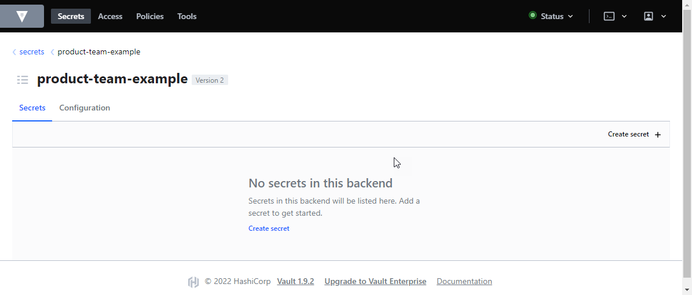
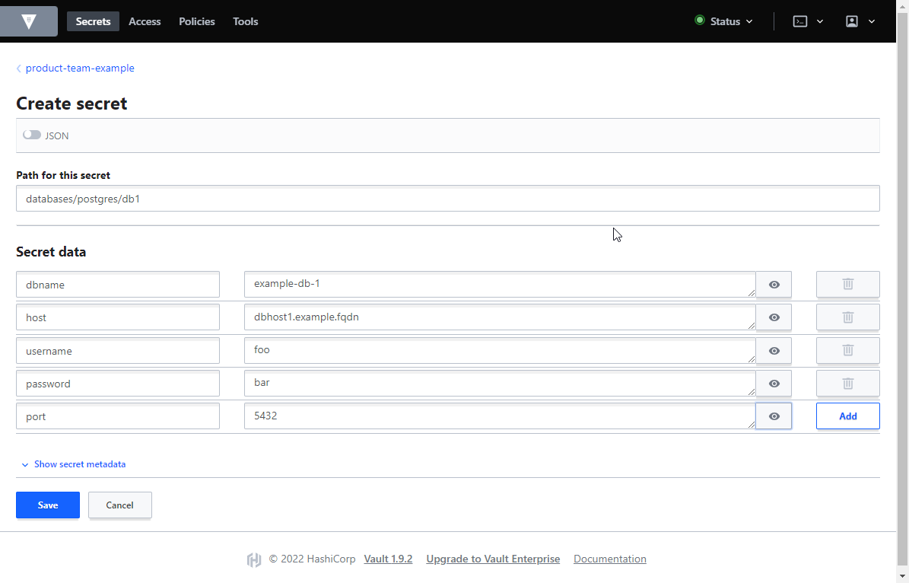

---
title: How To Use HashiCorp Vault
--- 

This guide is a small howto about storing your secrets using HashiCorp Vault. Following prerequisites have to be
met:

- your product-team must have been onboarded to Catena-X NG GitHub organization

For guidance of how to use secret with an ArgoCD application, please refer to
[_How To Use Vault Secrets With ArgoCD_](howto-use-vault-secrets-with-argocd.md).

The Catena-X Vault instance URL is: [https://vault.vault.demo.catena-x.net](https://vault.vault.demo.catena-x.net)

## Available Vault Login Methods

As of now, you can access Vault with the following authentication methods:

- GitHub (Token based)
- AppRole

GitHub Token is intended for personal login to Vault. The AppRole method is used for machine logins, aka your ArgoCD
application will use this method to authenticate against Vault. This guide will cover only the login methods for
personal login methods.

Planned login/authentication methods:

- OIDC login (using GitHub as SSO, as you know it from ArgoCD UI)

## Create GitHub Token

To be able to use GitHub Token as login method with Vault you have to create a personal token with appropriate
permissions granted. To create a personalized token:

- login to GitHub and go to [Settings / Developer settings / Personal access tokens](https://github.com/settings/tokens)
  .
- click on the _Generate new token_ button in the upper right corner
- add a _Note_ that fits your needs (this helps you to identify the intent of the token later)
- select an _Expiration_ date
- grant [_read:org_](https://www.vaultproject.io/docs/auth/github) permissions to your token
- click on _Generate token_ at the bottom of the form.

After these steps GitHub will show you the token.

:::danger

GitHub will show the token **only once** after creation. If you miss to safe the token in any kind you'll have to
generate a new token and revoke the old one for security reasons.

We strongly suggest to use a password manager like [KeePass](https://keepass.info) (or any other password manager) to
store personal sensitive data.

:::

## Using The Token To Login

### Vault WebUI

To log in to Vault using your generated GitHub token, go to [Vault](https://vault.vault.demo.catena-x.net), select
_GitHub_ as Method and enter your token in the field _GitHub token_:


### Vault CLI

You can also use the [Vault Cli](https://www.vaultproject.io/downloads) to manage your secrets. To login in CLI execute
the following steps:

```shell
$ export GH_TOKEN="YOUR_TOKEN"
$ export VAULT_ADDR="https://vault.vault.demo.catena-x.net:443"
$ vault login -method=github token=$GH_TOKEN
Success! You are now authenticated. The token information displayed below
is already stored in the token helper. You do NOT need to run "vault login"
again. Future Vault requests will automatically use this token.

Key                    Value
---                    -----
token                  s.Bzfdei921xxx
token_accessor         snJKHKjhadsxxx
token_duration         768h
token_renewable        true
token_policies         ["your_team_name"]
identity_policies      []
policies               ["your_team_name" "default"]
token_meta_username    YourGHName
token_meta_org         catenax-ng
$
```

## Create A Secret

### Vault WebUI

After login to Vault, you'll have access to the Vault secret engine/store created for your product-team.



To create a secret

- click on _Create secret +_ in the upper right area
- enter a _Path for this secret_, this will be the secret name
- add as many _Secret data_ lines, as you require to store in this secret
- click on the _Save_ button to store your first secret


Secret data values have been made visible for demonstration purpose. By default values aren't visible in plain text.

After you have created your first secret in Vault, the path is created inside your secret store and can be browsed
easily.


:::tip

We strongly suggest to organize secrets in folders based on its intention. Vault will automatically create folders, if
you enter a specific path.

:::

### Vault Cli

To create a secret using the CLI execute the command `vault kv put path/to/secret key1=value2 [key2=value2]`, example:

```shell
$ vault kv put product-team-example/hello foo=bar
========= Secret Path =========
product-team-example/data/hello

======= Metadata =======
Key                Value
---                -----
created_time       2022-04-14T13:42:08.41991265Z
custom_metadata    <nil>
deletion_time      n/a
destroyed          false
version            1
```

## Read A Secret

### Vault WebUI

Login to Vault and browse to the secret you need, and click on the copy icon.


### Vault CLI

To read a secret using the CLI execute the command `vault kv get path/to/secret`, example:

```shell
$ vault kv get product-team-example/hello
========= Secret Path =========
product-team-example/data/hello

======= Metadata =======
Key                Value
---                -----
created_time       2022-04-14T13:42:08.41991265Z
custom_metadata    <nil>
deletion_time      n/a
destroyed          false
version            1

=== Data ===
Key    Value
---    -----
foo    bar
```

## See Also

For further information about Hashicorp Vault please refer to their [documentation](https://www.vaultproject.io/docs).
