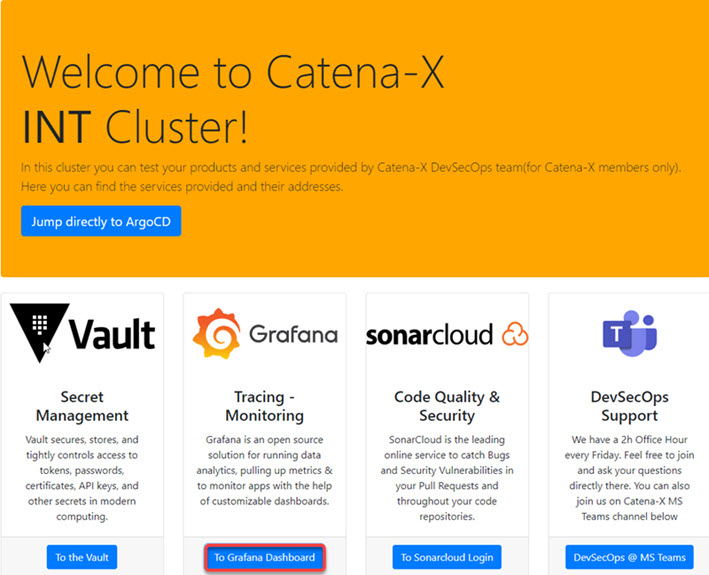
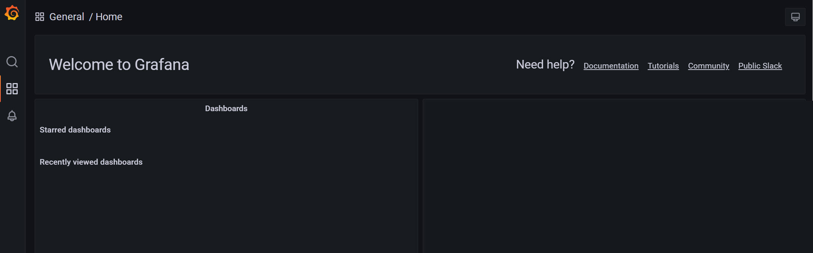
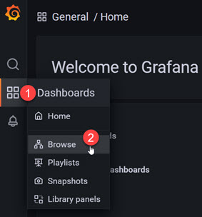
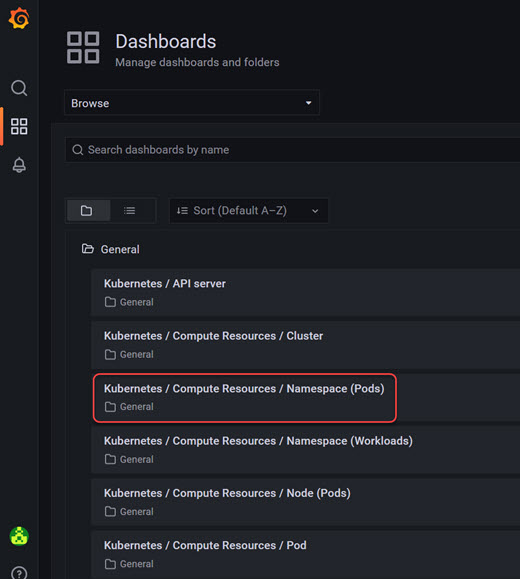

To get information about e.g. CPU and memory usage, a Grafana dashboard is provided.
You can get to the dashboard via the landingpage(s)

DEV: [https://home.dev.demo.catena-x.net/](https://home.dev.demo.catena-x.net/)

INT: [https://home.int.demo.catena-x.net/](https://home.int.demo.catena-x.net/)

or directly to these urls:

DEV: [https://grafana.dev.demo.catena-x.net/](https://grafana.dev.demo.catena-x.net/)

INT: [https://grafana.int.demo.catena-x.net/](https://grafana.int.demo.catena-x.net/)

## Login to Grafana

Login via GitHub

if you do this the first time the authorization must be given

the Grafana start page opens without any dashboard

## Setting up a predefined dashboard

Go to Dashboards > Browse

all available dashboards are listed, but this might be the most interesting for you:  
_Kubernetes/Compute Resources/Namespace (Pods)_  
to check CPU usage, memory usage and a few things more

