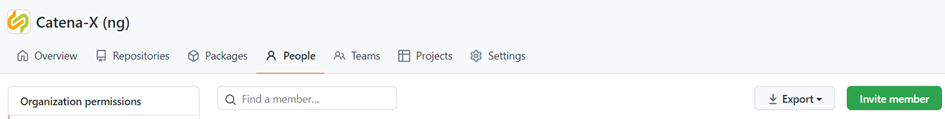
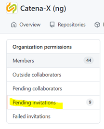
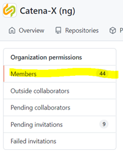
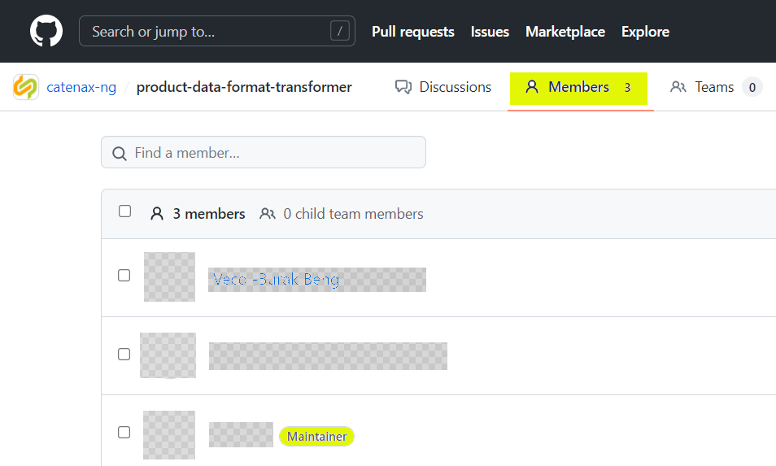
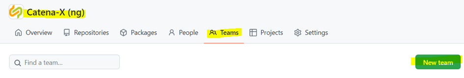
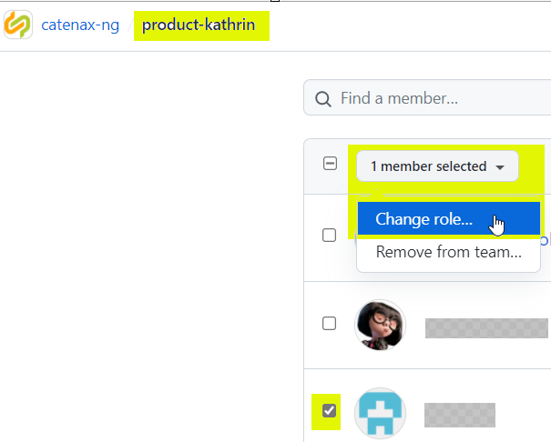
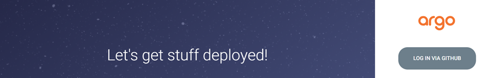
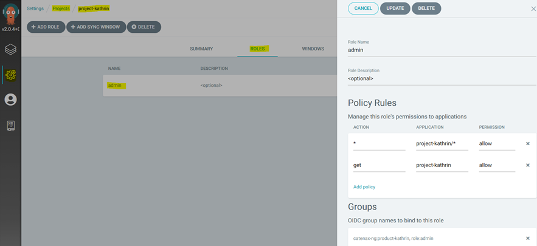

**This guide is only for those who operate the environment**

## Which channel can/should be used to ask for onboarding
Teams-channel [CX - CoP DevSecOps](https://teams.microsoft.com/l/channel/19%3a9a3c4a05a3514d07b973c13e7b468709%40thread.tacv2/CX%2520-%2520CoP%2520DevSecOps?groupId=17b1a2dc-67fb-4a49-a2ed-dd1344321439&tenantId=1ad22c6d-2f08-4f05-a0ba-e17f6ce88380)

If the link doesn't work for you try: "Communities of Practices" → "hidden Channels" → "CX - CoP DevSecOps" in your Catena-X Teams.

## What we need from a team member
who wants to login to GitHub Catena-X and deploy

1. **GitHub user**
2. **GitHub team** (initially created by DevSecOps team)
naming convention: 'product-<product-name\>' to make sure to separate the core repositories with the product repositories

on https://github.com/orgs/catenax-ng/people \> 'invite member'



invited person is in the list of ‘pending invitations’



invited person gets an email with invitation – by accepting the invitation, the person is member of the list ‘members’



**Now the person has been invited and added as member to the organization**

**Troubleshooting:**
If the person gets no email: the person should check the github notifications-box or/and email spam folder

## Creating a Jira-task
1. who wants which access
2. use ‘labels’ for differentiate tasks e.g. 'onboarding', 'maintainer switched'
3. add to current sprint
***example of description in a Jira-task:***
Contact Person: <name of the person\>
- Invite to catenax-ng
- Invite to team <name of the team (same as github project name)\>
- Setup RBAC rules for team
- Setup kubernetes namespace and ArgoCD Project

***Situation a:***
Add person to an existing team:
give the information about the ‘maintainer’ who should add the new member to the existing group



***Situation b:***
Add person to a non-existing team:
- Create a new team:



- Team-name (naming convention: 'product-<github project name\>')
- Description: optional
- No parent team
- Team visibility: visible
- Create team

Add new member and change role to maintainer



**Now argoCD login via GitHub is possible!**
https://argo.demo.catena-x.net/



## Allow argoCD login for teams that want to deploy
Take ‘template’ from environment-documentation/hotel-budapest/projects/ duplicate, rename and customize:
- Argo project-name: new name of the argo project (in our case: same as github project name)
- K8s namespace: new name of the K8s namespace (in our case is the naming convention: 'product-<github project name\>')
- role-name: name of role (freely definable), but recommended to give always the same
name, e.g. admin. Currently the access is always the same:
for all ‘read-only’, but only for the ‘own’ namespace read/write rights
- team-name: name of the formerly created team (github: https://github.com/orgs/catenax-ng/teams)

add, commit, push new yaml-file in git repository

the role of the argoCD-project can be found in argoCD:
argoCD \> settings \> projects \> ‘project’ \> roles



## Create a new argocd project with yaml-file

- Start (e.g. with PowerShell) from where the yaml-file is located
- Check, if in the right cluster:
kubectl config current-context
- run the yaml-file in namespace 'argocd':
kubectl apply –f <name of yaml-file\> -n argocd

**Now argoCD access to all existing projects (read-only) and the 'own' project (read/write) is possible!**

## Enable access to a private repository via deploy key

:::note
#### The project/product has to follow the steps

which can be found here: [How to prepare a private repo](guides/how-to-prepare-a-private-repo)

:::

#### The devsecops team has to do following steps
- Go to catenax-ng\k8s-cluster-stack\environments\<environment\>\argo-repos
- Add a file named <product-name\>-repo.yaml
- Add the new file to the environments kustomization.yaml

e.g. for product-semantics (product-semantics-repo.yaml)
```bash
apiVersion: v1
kind: Secret
metadata:
  name: product-semantics-repo
  namespace: argocd
  annotations:
    avp.kubernetes.io/path: "semantics/data/deploy-key"
  labels:
    argocd.argoproj.io/secret-type: repository
stringData:
  type: git
  url: git@github.com:catenax-ng/product-semantics
  name: product-semantics-repo
  project: project-semantics
  sshPrivateKey: |
    <semantics-deploy-key>
```
- Add following line to \catenax-ng\k8s-cluster-stack\environments\hotel-budapest\kustomization.yaml
```bash
- argo-repos/product-semantics-repo.yaml
```

## Enable access to a private package (central pull secret)

- Create a PAT within Github user account (machine user)
settings - Developer settings - Personal access token.
Be sure to give just the needed rights (read:package will be sufficient to deploy)
- Now do a base64 encoding for the PAT
$ echo -n "<username\>:<PAT\>" | base64
- Create a file “.dockerconfigjson” containing the base-64 encoded PAT
```
  {
    "auths":
    {
      "ghcr.io":
      {
        "auth":"<base-64 encoded PAT>"
      }
    }
  }
```
- Do a base 64 encoding for the auth part
$ echo -n'{"auths":{"ghcr.io":{"auth":"<base-64 encoded PAT\>"\}}}' | base64
If the output is divided into 2 lines, just add the second line to the first (without space)
- Create a file “dockerconfigjson.yaml”
```
kind: Secret
type: kubernetes.io/dockerconfigjson
apiVersion: v1
metadata:
  name: budapest-machine-user-read-package
  labels:
    app: app-name
data:
  .dockerconfigjson: <base64 encoded auth part, output from second base64 encoding>
```
- Then add the secret to the cluster
```
kubectl create -f dockerconfigjson.yaml
```
- Pull secret has to be added to the product´s code
  ```bash
  imagePullSecrets:
    - name: <name of the pull secret>
  ```

## Enable access to a private package (own secret over vault)
- To be done