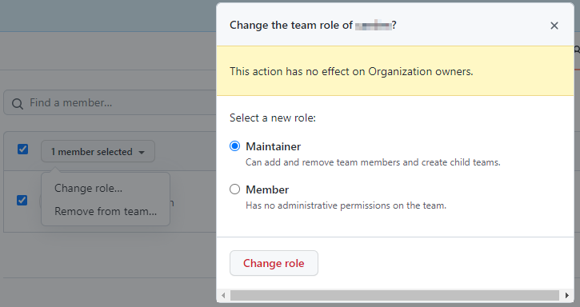
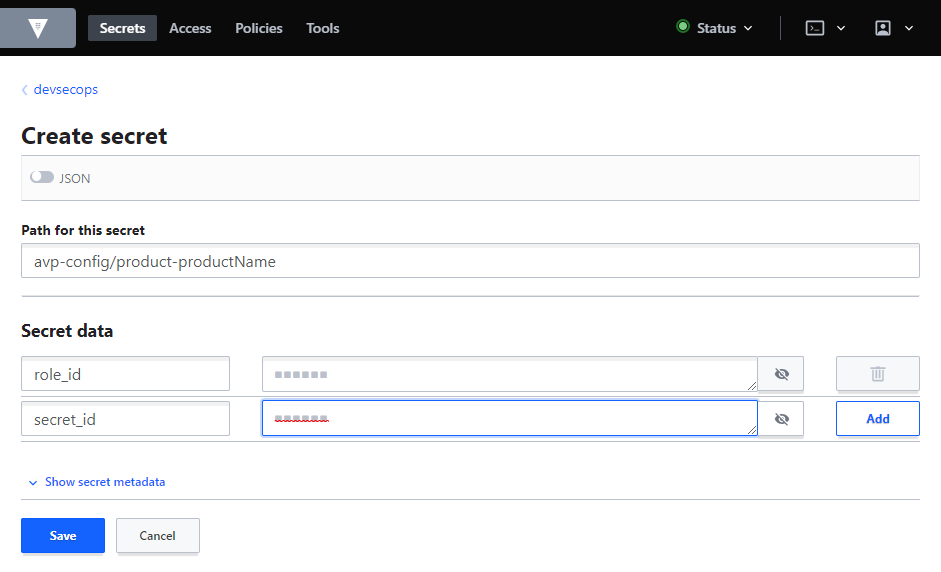

:::info

This guide is only for those who operate the environment

:::

## Create A Jira Task

:::caution

This chapter needs to be rewritten/redefined due to unclear statements in former version of this document!

:::

### Team Onboarding

1. who wants which access
2. use ‘labels’ for differentiate tasks e.g. 'onboarding', 'maintainer switched'
3. add to current sprint

### Member Onboarding

1. who wants which access
2. use ‘labels’ for differentiate tasks e.g. 'onboarding', 'maintainer switched'
3. add to current sprint

## GitHub - Prerequisites

### Invite Someone To The GitHub Organization

Prerequisites:

- GitHub username, Full Name or email address of person to onboard
- GitHub team name to invite someone to (the team must have been created by DevSecOps team)

To invite a person to a specific GitHub team, follow these steps:

- In GitHub organization go to [People](https://github.com/orgs/catenax-ng/people)
- Click button _Invite member_ on the right side
- In the field _Search by username, full name or email address_ enter one of the suggestions and select user
- Click on _Invite_ to finally invite someone to CatenaX-NG GitHub organization

:::info

The person must click/accept the invitation to our GitHub organization before someone can be added to one of our
organization teams.

:::

### GitHub Team

If a team requests for initial onboarding to CatenaX-NG GitHub organization, follow these steps to create a team inside
GitHub organization:

- In GitHub organization go to [Teams](https://github.com/orgs/catenax-ng/teams) and click button _New team_ in the
  right
  upper corner
- Insert _Team name_ with naming schema `product-<productName>`
- Add optional _Description_
- Apply defaults for _Parent team_ and _Team visibility_
- Click button _Create team_ to finally create the team

### Add a Member To A GitHub Team

Prerequisites:

- Person must have accepted the invitation to the GitHub organization
- GitHub username of whom to onboard (person must have been invited _and_ joined our GitHub organization)
- GitHub team to invite to (the team must have been created by DevSecOps team)

To add a member to a GitHub team, follow these steps:

- In GitHub organization go to [Teams](https://github.com/orgs/catenax-ng/teams)
- Click on the team name a member should be added to
- Click on _Members_ in the top menu inside the selected GitHub team
- Click on the green button _Add a member_ in the upper right
- Type the GitHub _username, full name, or email addess_ and click _Invite_

After the member has been added to the GitHub team, check the checkbox in front of the new member and change role to _
Maintainer_:



:::tip

If the person gets no email: the person should check the GitHub notifications-box or/and email spam folder.

:::

## Vault

To provide a product-team access to our Vault instance, following onboarding steps must be performed:

- enable (create) a new _Secrets_ engine
- create _Policies_
- create GitHub auth mapping
- create AppRole
- store AppRole specifics into DevSecOps Vault secret store

### Enable New Secret Engine

To enable/create a new secret engine for a product-team,

- use Vault WebUI
- in _Secrets_ section click on _Enable new engine_
- on Page _Enable a Secrets Engine_ select _KV_ in _Generic_ section and _Next_ on the bottom
- replace _kv_ in _Path_ field with the product-team name following the naming schema `product-productName` (
  e.g. `product-edc`)
- use defaults for _Maximum number of versions, Require Check and Set, Automate secret deletion, Method Options_
- click on _Enable Engine_

### Create Policies

There will be 2 policies created for each team, following this naming schema:

- _product-productName_
- _product-productName-ro_

The _product-productName_ policy will be applied to personal auth methods (as of now GitHub Token), the _
product-productName-ro_ policy will be applied to AppRole auth method.

To create the policies, login to Vault and

- click on _Policies_ in the top menu
- click on _Create ACL policy +_
- enter the policy name in the _Name_ field
- enter following to _Policy_ field:
  - for the _product-productName_ policy

  ```
  path "product-productName/*" {
    capabilities = ["create", "read", "update", "delete", "list"]
  }
  ```
  
  - for the _product-productName-ro_ policy

  ```
  path "product-productName/*" {
    capabilities = ["read"]
  }
  ```

### Create GitHub Auth Mapping

To enable GitHub Token auth for any product-team a GitHub auth mapping has to be created. To create the mapping Vault
CLI is required.

```shell
vault write auth/github/map/teams/product-team-name value=product-team-name
```

:::info

`value=product-team-name` links to the policy _product-productName_ created in the step before.

To be able to use the Vault CLI please refer to [How to use Vault docu](../guides/how-to-use-vault.md#vault-cli)

:::

### AppRole

Following steps have to be performed as of now manually. It's planned to create a script bases automation for this in
PI4.

#### Create AppRole

For each team to onboard a AppRole has to be created using the Vault CLI:

```shell
$ vault write auth/approle/role/product-productName \
    secret_id_ttl=10m \
    token_num_uses=10 \
    token_ttl=20m \
    token_max_ttl=30m \
    secret_id_num_uses=40
```

After the AppRole has been created for the team, _secret_id_ and _role_id_ have to be issued/read.

#### The Secret ID

The _secret_id_ has to be issued by

```shell
vault write -f auth/approle/role/product-productName/secret-id
```

The command will output the _secret_id_ for _product-productName_ AppRole. Remember the _secret_id_ for later use.

#### The Role ID

Despite of the _secret_id_ the role Id must not be issued but can be read:

```shell
vault read auth/approle/role/product-productName/role-id
```

The command will output the _role_id_ for _product-productName_ AppRole. Remember the _role_id_ for later use.

### Store The Teams role_id and secret_id In Vault

For later usage of team specific AppRole _role_id_ and secret_id_ we've to store them in our DevSecOps Vault:

- enter _devsecops_ secret engine
- browse to _avp_config_
- click on _Create secret+_ in the right upper
- enter _avp-config/product-productName_ in _Path for this secret_ and create _Secret data_ for
  - role_id
  - secret_id
    

:::info

This secret will be used for later creation of _vault-secret_ to enable the teams to use Vault with ArgoCD.

:::

## ArgoCD

To provide a product-team access to the Hotel Budapest infrastructure following onboarding steps must be performed (all
steps are related to repository [k8s_cluster_stack](https://github.com/catenax-ng/k8s-cluster-stack)):

- create ArgoCD project
- create AVP secret
- deploy ArgoCD project and AVP secret

Create a new branch in [k8s_cluster_stack](https://github.com/catenax-ng/k8s-cluster-stack) repo for onboarding a new
product-team to ArgoCD.

### Create ArgoCD Project

Create a manifest for the new product-team to create:

- k8s namespace
- ArgoCD project:

```yaml
apiVersion: v1
kind: Namespace
metadata:
  name: product-productName
---
apiVersion: argoproj.io/v1alpha1
kind: AppProject
metadata:
  name: product-productName
  namespace: argocd
spec:
  description: Project for product-productName
  sourceRepos:
    - '*'
  destinations:
    - namespace: product-productName
      server: https://kubernetes.default.svc
  # Allow all namespaced-scoped resources to be created, except for ResourceQuota, LimitRange, NetworkPolicy
  namespaceResourceBlacklist:
    - group: ''
      kind: ResourceQuota
    - group: ''
      kind: LimitRange
    - group: ''
      kind: NetworkPolicy
  roles:
    - name: team-admin
      description: All access to applications inside project-bpdm. Read only on project itself
      policies:
        - p, proj:product-productName:team-admin, applications, *, product-productName/*, allow
      groups:
        - catenax-ng:product-productName

```

Store this manifest in [k8s-cluster-stack](https://github.com/catenax-ng/k8s-cluster-stack) repo in
path `environments/hotel-budapest/argo-projects/`.

### Create AVP Secret

To enable the product-team to use Vault with ArgoCD create a team specific AVP secret manifest:

```yaml
apiVersion: v1
kind: Secret
metadata:
  annotations:
    avp.kubernetes.io/path: "devsecops/data/avp-config/product-productName"
  name: vault-secret
  namespace: product-productName
type: Opaque
stringData:
  VAULT_ADDR: https://vault.vault.demo.catena-x.net/
  AVP_TYPE: vault
  AVP_AUTH_TYPE: approle
  AVP_ROLE_ID: <role_id>
  AVP_SECRET_ID: <secret_id>
```

Store this manifest in [k8s-cluster-stack](https://github.com/catenax-ng/k8s-cluster-stack) repo in
path `environments/hotel-budapest/avp-secrets/`.

The secret will be called _vault-secret_ and stored in k8s namespace related to product-team.

### Prepare Deployment Of ArgoCD Project And AVP Secret

To deploy k8s namespace, ArgoCD Project and the AVP secret to Hotel Budapest you'll have to add the two created manifest
files to `environments/hotel-budapest/kustomization.yaml`
in [k8s-cluster-stack](https://github.com/catenax-ng/k8s-cluster-stack) repo:

```yaml
apiVersion: kustomize.config.k8s.io/v1beta1
kind: Kustomization

#namespace: argocd

resources:
  [ ... ]
  - argo-projects/product-productName.yaml
  - avp-secrets/productName-vault-secret.yaml
  [ ... ]
```

Please add the new product-team in alphabetical order to the _resources_ section of file `kustomization.yaml`.

### Create Pull Request

After you have created the three files

- `environments/hotel-budapest/argo-projects/product-productName.yaml`
- `environments/hotel-budapest/avp-config/productName-team-vault-secret.yaml`
- `environments/hotel-budapest/kustomization.yaml`

create a PR for your branch. After the PR has been approved and merged into main branch, the new team will be
automatically deployed to Hotel Budapest cluster (via ArgoCD application _hotel-budapest-config_ at ArgoCD _CORE_
cluster).

## Special Topics

### Enable access to a private repository via deploy key

:::note

The project/product has to follow the steps which can be found
here: [How to prepare a private repo](guides/how-to-prepare-a-private-repo).

:::

- Go to `catenax-ng\k8s-cluster-stack\environments\hote-budapest\argo-repos`
- Add a file named `<productName>-repo.yaml`, e.g. for _product-semantics_ (`product-semantics-repo.yaml`):

  ```yaml
  apiVersion: v1
  kind: Secret
  metadata:
    name: product-semantics-repo
    namespace: argocd
    annotations:
      avp.kubernetes.io/path: "semantics/data/deploy-key"
    labels:
      argocd.argoproj.io/secret-type: repository
  stringData:
    type: git
    url: git@github.com:catenax-ng/product-semantics
    name: product-semantics-repo
    project: project-semantics
    sshPrivateKey: |
      <semantics-deploy-key>
  ```

- Add following line to `environments/hotel-budapest/kustomization.yaml`

  ```yaml
  - argo-repos/product-semantics-repo.yaml
  ```

### Enable access to a private package (central pull secret)

- Create a PAT within GitHub user account (machine user)
  settings - Developer settings - Personal access token.
  Be sure to give just the needed rights (read:package will be sufficient to deploy)
- Now do a base64 encoding for the PAT
  $ echo -n "<username\>:<PAT\>" | base64
- Create a file `.dockerconfigjson` containing the base-64 encoded PAT

  ```json
    {
      "auths":
      {
        "ghcr.io":
        {
          "auth":"<base-64 encoded PAT>"
        }
      }
    }
  ```

- Do a base 64 encoding for the auth part

  ```shell
  echo -n'{"auths":{"ghcr.io":{"auth":"<base-64 encoded PAT\>"\}}}' | base64
  ```

  If the output is divided into 2 lines, just add the second line to the first (without space)
- Create a file `dockerconfigjson.yaml`:

  ```yaml
  kind: Secret
  type: kubernetes.io/dockerconfigjson
  apiVersion: v1
  metadata:
    name: budapest-machine-user-read-package
    labels:
      app: app-name
  data:
    .dockerconfigjson: <base64 encoded auth part, output from second base64 encoding>
  ```

- Then add the secret to the cluster
  
  ```shell
  kubectl create -f dockerconfigjson.yaml
  ```

- Pull secret has to be added to the product´s code

  ```yaml
  imagePullSecrets:
    - name: <name of the pull secret>
  ```

### Enable access to a private package (own secret over vault)

- To be done
