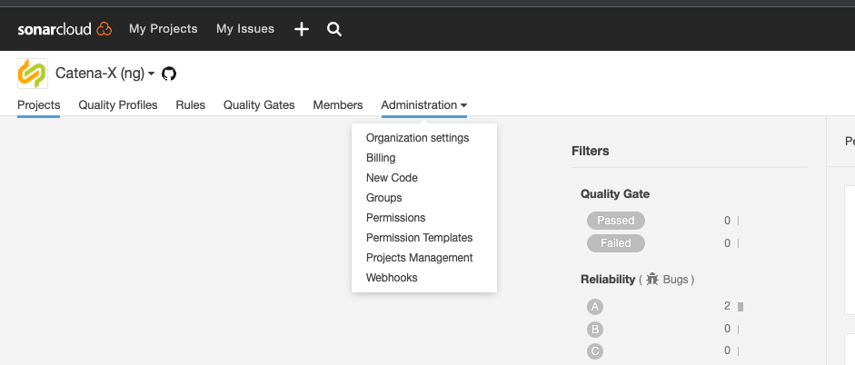
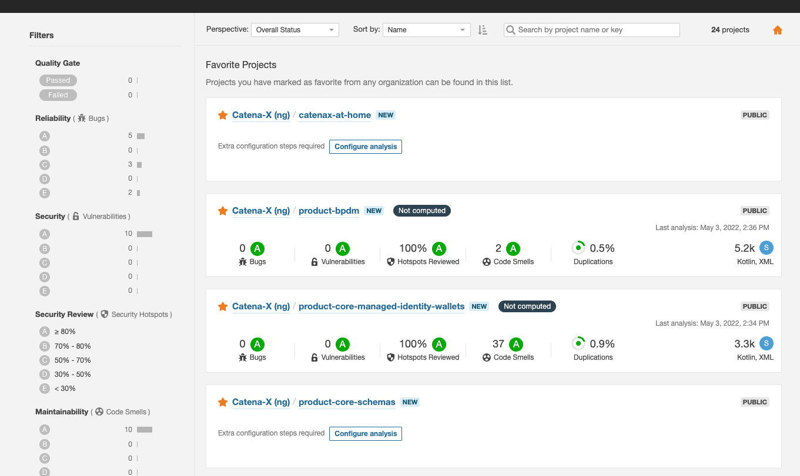
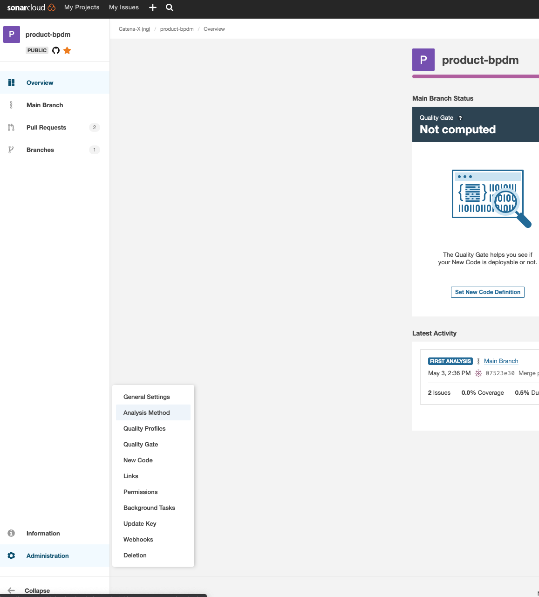

:::info
This guide is only for those who operate the environment
:::

## SonarCloud overview

Catena-X uses Sonarcloud to do quality checks. [SonarCloud](https://sonarcloud.io/) is an online service offering [SonarQube](https://en.wikipedia.org/wiki/SonarQube) and is free for opensource projects.

## How to onboard into SonarCloud

### Prerequisite

- Make sure to create a support ticket for tracking in case no ticket was created from our customer
- You need admin permissions. All team members should already have admin permissions, pls talk to a colleague to get yours if missing
- The project to scan, needs to be public. We do not have any paid plan and only public repositories are free

### Add project

- Hover over **Administration**
  
- Select **Projects Management**
  
- After the page loaded, go to **Analyse new projects** which is on the right side
  
- Select the **public** repository, you like to onboard
  

:::caution
You now need to wait for SonarCloud to analyse the project. After the project is available in the overview page and analysed, continue with the next section
:::

### Share **SONAR_TOKEN**

Now the project is in SonarCloud. You can now enable customers to use SonarCloud with Github Actions.

- Select the new project
  
- On the left navigation at the bottom there is **Administration**. Hover over it and go to **Analysis Method**
  
- One of the options is **Github Action**. Go to **Follow the tutorial**
  
- This page shows you the **SONAR_TOKEN** required for our customers Github Action to do a more specific scanning. Default scanning of SonarCloud works for Java as a first try but it should be added as a Github Action.
  
