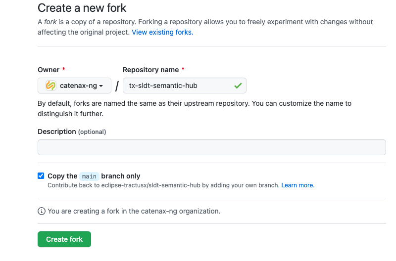

:::info

This guide is only for those who operate the environment

:::

This how-to will guide you through the the steps to managed a forked repositories from eclipse-tractusx into catena-x organization

## Fork a repository from eclipse-tractusx

You should start off manually fork a repository into catena-x organization. Please make sure to use prefix `tx` for the name of repository in catena-x.


## Add the repository and which team can maintain it into terraform script

### Add Repository

Add the repository configuration into this [script](https://github.com/catenax-ng/k8s-cluster-stack/blob/main/terraform/100_team_onboarding/main.tf) under `github_repositories`.
The example looks like this:

```
"tx-portal-backend" : {
      name : "tx-portal-backend"
      team_name : "product-portal"
      description : ""
      visibility : "public"
      homepage_url : ""
      topics : []
      pages : {
        enabled : false
        branch : ""
      }
      is_template : false
      uses_template : false
      template : null
      codeowners_available : false
      codeowners : null
      archived : false
    }
```

Please make sure you adjust the example to the actual repository settings.

### Add Repository & Team Mapping

And add the mapping of team to repository under `github_repositories_teams` like following:

```
"tx-portal-backend-product-portal" : {
    team_name : "product-portal"
    repository : "tx-portal-backend"
    permission : "maintain"
}
```

## Import the state of existing forked repository

Following the guide [here](https://github.com/catenax-ng/product-onboarding/tree/main/github#terraform-variable-settings-for-github-scripts) to set up the credentials for running terraform
Now you may import the forked github repository from [previous step](#fork-a-repository-from-eclipse-tractusx).

```shell
# Import a GitHub repository
terraform import 'github_repository.repositories["map-key-in-github_repositories-var"]' <repository-name>
```

After the state of repository has been imported successfully. You might run the terraform plan:

```shell
terraform plan -out tf.plan
```

Observe the differences between the current and the desired state of the repository and make change to the desired state if necessary.

Last but not least, follow the git workflow to have the changes approval and merged and in the end, run the following command to apply the changes

```shell
terraform apply "tf.plan"
```
