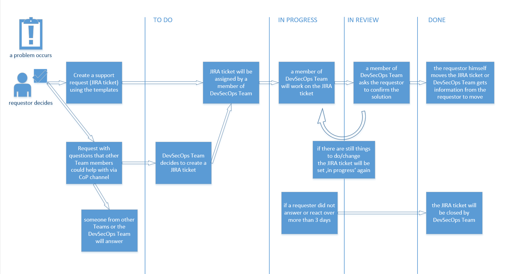

# Things to request

We provide a standard set of resources you can request. Please create a ticket within our Jira with the following
templates and fill it out based on the information from the specific resource you want.

If you need additional help or advice on how to structure your repository after the transition from catenax, just reach
out to us on the
[CoP Channel](https://teams.microsoft.com/l/channel/19%3a9a3c4a05a3514d07b973c13e7b468709%40thread.tacv2/CX%2520-%2520CoP%2520DevSecOps?groupId=17b1a2dc-67fb-4a49-a2ed-dd1344321439&tenantId=1ad22c6d-2f08-4f05-a0ba-e17f6ce88380).

## User invitation to the catenax-ng GitHub organization

If you need access to repositories inside the catenax-ng organization or you want to use ArgoCD for deploying an
application on one of the demonstrator environments, you need to request an invitation to the catenax-ng GitHub
organization via
[this Jira template](https://jira.catena-x.net/secure/CreateIssueDetails!init.jspa?pid=10212&issuetype=10401&components=10401&priority=3&summary=GitHub%3A%20Invite%20member&description=%0AGitHub%20user%3A%20_your_user_%0AVouching%20person%3A%20_your_PO_&labels=XS).

Once you are part of the organization, you can be invited to teams by maintainers of the different product teams. If
there is no team inside the organization for your product yet, you can request that too.

## Complete onboarding of a new product

If you are responsible for a new product which has to be onboarded (including new team, new repo, ArgoCD and Vault)
please use
[this Jira template](https://jira.catena-x.net/secure/CreateIssueDetails!init.jspa?pid=10212&issuetype=10401&components=10401&priority=3&summary=Onboard%20new%20product&description=Product%20name%3A%20%0AGitHub%20users%20to%20invite%3A%20_github_user_account_%20%0AVouching%20person%3A%20_your_PO_&labels=L).

## GitHub team in catenax-ng

GitHub teams are used to grant multiple user access to the same resources. Teams are also used to grant access to
projects in ArgoCD and secrets in Vault. Usually each Catena-X product team will have one team in the catenax-ng GitHub
organization.

You can issue this request via
[this Jira template](https://jira.catena-x.net/secure/CreateIssueDetails!init.jspa?pid=10212&issuetype=10401&components=10401&priority=3&summary=GitHub%3A%20New%20Team&description=%0AProduct%20team%20name%3A%20_your_product_team_name_%0AGitHub%20users%20to%20invite%3A%20%0A%20%20-%20_github_user_account_&labels=XS).

The initially invited people will be granted maintainer access to the team. Every additional team member will then be
invited by one of the maintainers.

## GitHub repository in catenax-ng

If you need to collaborate on source-code, you can request a repository in the catenax-ng GitHub organization. You can
request as many repositories as you need for your team. We offer these repositories during the transition phase from the
Catena-X organization to proper open-source repositories in the eclipse foundation. After moving your repositories to
eclipse foundation, you can still use catenax-ng for deployment specific configuration of the demonstrator environments.

There is an option to use the [k8s-helm-example](https://github.com/catenax-ng/k8s-helm-example) repository to use as a **template for the new repository**. It serves as a jumpstart with a basic **helm chart** setup, enabled **github pages** and **github action to release helm charts** to github pages. This option can be requested in the Jira template.

To request a new repository, please use
[this Jira template](https://jira.catena-x.net/secure/CreateIssueDetails!init.jspa?pid=10212&issuetype=10401&components=10401&priority=3&summary=GitHub%3A%20New%20repository&description=%0Arepository%20name%3A%20product-_your_product_name_%0A%0Ause%20https%3A%2F%2Fgithub.com%2Fcatenax-ng%2Fk8s-helm-example%C2%A0repo%20as%20template%20and%20setup%20github%20pages%20for%20helm%20publishing%3A%20_yes%2Fno_%0A%0A%0AGitHub%20team%20to%20grant%20access%3A%0A%0A_github_team_name_&labels=XS).

:::info

Permissions on a repository are granted on a team level and not to individuals. Standard permission will be 'maintain',
since administrative tasks are not allowed for product teams and will be done by organization admins. If there are any
questions regarding this, feel free to reach out in the CoP channel.

:::

## Request access to an existing environment/namespace

If you need access to a specific environment, or a namespace on an environment, check if you are already part of the
catenax-ng GitHub organization. If not, please request access first, like described
in [this section](https://catenax-ng.github.io/docs/resources#user-invitation-to-the-catenax-ng-github-organization).

If you are already a member of the GitHub organization, please
use [this Jira template](https://jira.catena-x.net/secure/CreateIssueDetails!init.jspa?pid=10212&issuetype=10401&components=10401&priority=3&summary=Environment%3A%20request%20access&description=%0AEnvironment%3A%20_DEV%20%2F%20INT_%0Anamespace%3A%20_name_of_namespace_%0AGitHub%20team%3A%20_team_that_should_have_access_%0AGitHub%20users%3A%20_github_user_that_should_have_access_&labels=S)
to request access.

## Request environment

> **BEWARE:** We do not provide dedicated environments for single teams. We will provide a DEV, INT, and PRE-PROD
> environment and teams will collectively use these environments together.
> A list of available environments can be found [in the Catena-X Confluence](https://confluence.catena-x.net/pages/viewpage.action?pageId=25228715).

Any environment beside DEV, INT and PRE-PROD should have a very specific use case like a fair or a special demonstration
event. In such cases, we provide a dedicated environment, that will only persist for this demonstration and will be
deleted afterwards.

Please use
[this Jira template](https://jira.catena-x.net/secure/CreateIssueDetails!init.jspa?pid=10212&issuetype=10401&components=10401&priority=3&summary=NEW%20ENVIRONMENT&description=%0APurpose%3A%20_environment_purpose_%0ARequested%20by%3A%20_person_requesting_the_demonstration_environment_%0AEnd%20date%20of%20demonstration%3A%20_dd.mm.yyyy_%0ATeams%20participating%3A%0A-%20_product_team_name_&lables=XL)
and fill out the details in the description.

## Request databases and other Azure services

Currently, we do not offer azure services as we try to provide a cloud agnostic platform stack. Please try to use a helm
dependency for services you require.

We will provide azure services soon but only for critical / central services.

## Request access / setup SonarCloud

Currently SonarCloud is NOT mandatory for Release 1. VeraCode is. If you want to use SonarCloud right now, you can
request scanning of **public** repositories (**private** are not supported!).

Use [this Jira template](https://jira.catena-x.net/secure/CreateIssueDetails!init.jspa?pid=10212&issuetype=10401&components=10401&priority=3&summary=SonarCloud%20onboarding&description=Public%20repository%20...&labels=S)
for SonarCloud support.

## Request assistance from Security team

The Catena-X Security expert team is happy to provide assistance with all security related topics. Exemplary requests
are:

- Security risk assessment (RRA, Threat modeling, Code reviews)
- Pentesting
- Veracode (initial setup, GitHub integration, Jira integration)
- Trivy
- Checkov
- Gitguardian

Please use
[this Jira template](https://jira.catena-x.net/secure/CreateIssueDetails!init.jspa?pid=10212&issuetype=10401&components=10401&priority=3&summary=Security%20request&description=Please%20specify%20the%20type%20of%20request.%20Exemplary%20requests%20are%3A%20%0A%20%20-%20Veracode%20%28initial%20setup%2C%20github%20integration%2C%20Jira%20integration%29%20%0A%20%20-%20Trivvy%20%0A%20%20-%20Checkov%20%0A%20%20-%20Gitguardian%20%0A%20%20-%20Pentesting%20%0A%20%20-%20Security%20risk%20assessment%20%28RRA%2C%20Threat%20modeling%2C%20Code%20reviews%29%0A&assignee=christian.winnen%40mhp.com&labels=L).

## Template for any requirement

If none of the topics apply or the
[CoP Channel](https://teams.microsoft.com/l/channel/19%3a9a3c4a05a3514d07b973c13e7b468709%40thread.tacv2/CX%2520-%2520CoP%2520DevSecOps?groupId=17b1a2dc-67fb-4a49-a2ed-dd1344321439&tenantId=1ad22c6d-2f08-4f05-a0ba-e17f6ce88380)
does not seem to be the right channel,
a [JIRA](https://jira.catena-x.net/secure/CreateIssueDetails!init.jspa?pid=10212&issuetype=10401&components=10401&priority=3&summary=blank%20template%20for%20any%20requirement&description=%0AGitHub%20user%3A%20_your_user_%0Ablank_template&labels=requirement-dependent)
'blank template' is available.

## General consulting requests

We are happy to help you out on several topics regarding DevSecOps. The following sections describe some of the most
common cases. In any case, you need help, feel free to get in contact with us through
the [CoP Channel](https://teams.microsoft.com/l/channel/19%3a9a3c4a05a3514d07b973c13e7b468709%40thread.tacv2/CX%2520-%2520CoP%2520DevSecOps?groupId=17b1a2dc-67fb-4a49-a2ed-dd1344321439&tenantId=1ad22c6d-2f08-4f05-a0ba-e17f6ce88380).

## Onboarding to Catena-X demonstrator environments (ArgoCD, Vault, etc.)

If you are not yet familiar with the setup of our demonstrator environments or the tools running on it, we will guide
you through the onboarding in a hands-on session. Just get in contact with us, and we will schedule this meeting.

## Setting up helm charts for your application

We highly encourage you to create a helm chart for your application. This will make it easy for you to deploy your
application to the demonstrator environments and will also help other teams, that depend on your application to
integrate against your app.

We can help you to create the helm chart, but before you get in contact with us, also check out the existing
guide [here](guides/Helm/helmchart.md).

## Graphical Support Workflow

