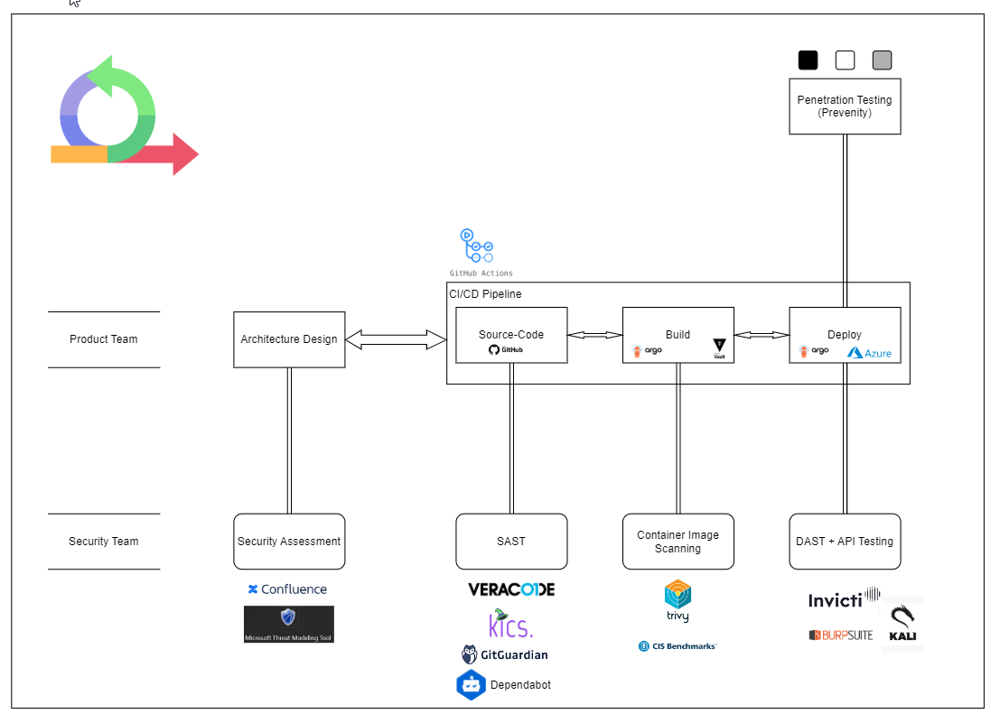

# Contact and Overview

## Contact

Let's secure Catena-X!

If you have any questions, please contact us *[dl_CoP_IT_Security@catena-x.net](mailto:dl_CoP_IT_Security@catena-x.net)*

## Overview

The security team offers the following services and tools to make your projects more secure.

We support the GitHub organizations: [Eclipse Tractus-X](https://github.com/eclipse-tractusx) and [Catena-X (ng)](https://github.com/catenax-ng)

We group repositories into:

- Forks: Copies of Eclipse Tractus-X repos.

- Playgrounds: Places where it is allowed to play, templates and documentation.

- Products: Repos in  Eclipse Tractus-X which are subject to quality gates and releases.

- Archived repos: No longer actively maintained repos (~plus entirely quality-less and insecure repos).

**Product repos must use our entire arsenal of security tools.**

We offer no security tooling support for forks. We are using some open source security tools which can be run anywhere which are free of use. If you fork to Catena-X (ng) you can use all tools.

Playground repos must use GitGuardian. We recommend to also use Trivy, KICS, and our Veracode "Pipeline Scan".
