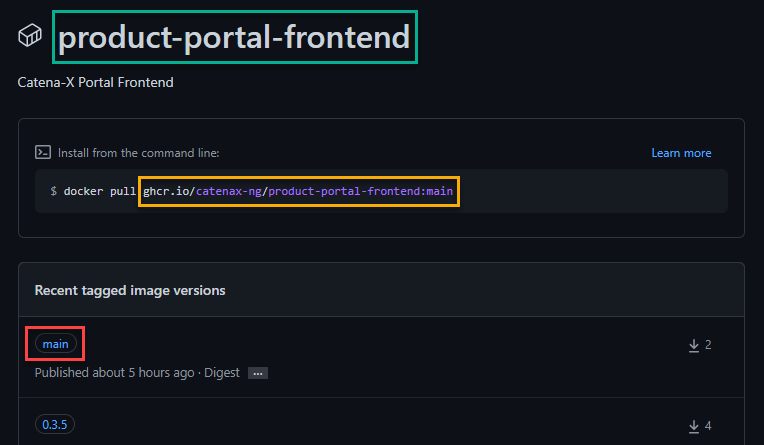

# How to integrate Trivy

We **scan containers** with Trivy.

Add the following GitHub action _trivy.yml_ to your repository workflows.

In order for Trivy to scan the correct GitHub packages, they must be specified in the action.

Integration steps per GitHub package:

1. Copy job `analyze-<REPLACE-ME container name\>`

2. Replace the name of the job with the name of the GitHub package - green box.

3. Replace `image-ref` with the yellow box of the GitHub package.

:::info

In order to always scan the latest GitHub package, a tag (red box) must be set for the packages and specified in the `image-ref`.

:::



```yaml
# Depending on the location of your Docker container
# you need to change the path to the specific Docker registry.
#
name: "Trivy"

on:
  push:
    branches: [main]
  # pull_request:
  # The branches below must be a subset of the branches above
  # branches: [ main ]
  # paths-ignore:
  #   - "**/*.md"
  #   - "**/*.txt"
  schedule:
    # Once a day
    - cron: "0 0 * * *"
  workflow_dispatch:
  # Trigger manually

jobs:
  analyze-config:
    runs-on: ubuntu-latest
    permissions:
      actions: read
      contents: read
      security-events: write

    steps:
      - name: Checkout repository
        uses: actions/checkout@v3

      - name: Run Trivy vulnerability scanner in repo mode
        uses: aquasecurity/trivy-action@master
        with:
          scan-type: "config"
          # ignore-unfixed: true
          exit-code: "1"
          hide-progress: false
          format: "sarif"
          output: "trivy-results1.sarif"
          severity: "CRITICAL,HIGH"

      - name: Upload Trivy scan results to GitHub Security tab
        uses: github/codeql-action/upload-sarif@v2
        if: always()
        with:
          sarif_file: "trivy-results1.sarif"

  analyze-<REPLACE-ME container name>:
    runs-on: ubuntu-latest
    permissions:
      actions: read
      contents: read
      security-events: write

    steps:
      - name: Checkout repository
        uses: actions/checkout@v3

      # It's also possible to scan your private registry with Trivy's built-in image scan.
      # All you have to do is set ENV vars.
      # Docker Hub needs TRIVY_USERNAME and TRIVY_PASSWORD.
      # You don't need to set ENV vars when downloading from a public repository.
      # For public images, no ENV vars must be set.
      - name: Run Trivy vulnerability scanner
        if: always()
        uses: aquasecurity/trivy-action@master
        with:
          # Path to Docker image
          image-ref: "<REPLACE-ME container name>"
          format: "sarif"
          output: "trivy-results2.sarif"
          exit-code: "1"
          severity: "CRITICAL,HIGH"

      - name: Upload Trivy scan results to GitHub Security tab
        if: always()
        uses: github/codeql-action/upload-sarif@v2
        with:
          sarif_file: "trivy-results2.sarif"
```
