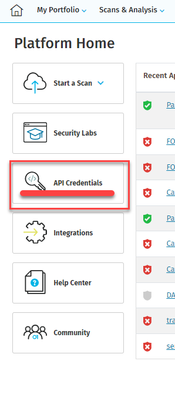
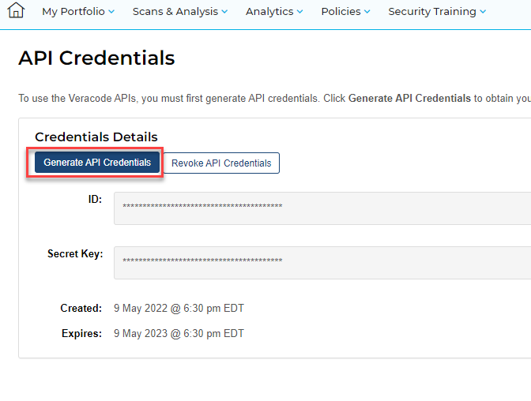

# Veracode

We perform **static application security testing**, **FOSS license scanning**, and **software composition analysis** with Veracode.

Two actions are provided - _upload and scan_ and _pipeline_.

For both actions Veracode api credentials are needed.





Please create GitHub Secrets for these confidential keys: `API_ID` and `API_KEY`.

## Upload and Scan

Depending on how your application is built, you will need to run the build once and configure it under `filepath`.

Also the name of the Veracode application must be specified under `appname`.

```yaml
name: "Veracode upload and scan"

on:
  push:
    branches: [main]
  # pull_request:
  # The branches below must be a subset of the branches above
  # branches: [ main ]
  # paths-ignore:
  #   - "**/*.md"
  #   - "**/*.txt"
  schedule:
    # Once a day
    - cron: "0 0 * * *"
  workflow_dispatch:
  # Trigger manually

jobs:
  analyze:
    runs-on: ubuntu-latest
    permissions:
      actions: read
      contents: read
      security-events: write

    steps:
      - name: Checkout repository
        uses: actions/checkout@v2

      - name: "Bundle / Build files to scan"
        run: zip -r foo.zip foo

      - name: Run Veracode Upload And Scan
        uses: veracode/veracode-uploadandscan-action@0.2.1
        with:
          appname: "<REPLACEME Veracode App Name>"
          createprofile: false
          filepath: "<REPLACEME Path to file>"
          vid: "${{ secrets.API_ID }}"
          vkey: "${{ secrets.API_KEY }}"
```

## Pipeline

The pipeline scan is a local scan that provides quick results that are imported into the Code Scanning Alerts dashboard. The pipeline scan only supports static application security testing.

For example, it can also run as a status check in the pull requests.

Replace `--file "<REPLACEME Path to file>"` with the path to your build or zipped files.

The results between the pipeline scan and the upload scan may differ.

```yaml
name: "Veracode pipeline scan"

on:
  push:
    branches: [main]
  # pull_request:
  # The branches below must be a subset of the branches above
  # branches: [ main ]
  # paths-ignore:
  #   - "**/*.md"
  #   - "**/*.txt"
  schedule:
    # Once a day
    - cron: "0 0 * * *"
  workflow_dispatch:
  # Trigger manually

jobs:
  analyze:
    runs-on: ubuntu-latest
    permissions:
      actions: read
      contents: read
      security-events: write

    steps:
      - name: Checkout repository
        uses: actions/checkout@v2

      - name: "Bundle / Build files to scan"
        run: zip -r foo.zip foo

      - name: Set up JDK 1.8
        uses: actions/setup-java@v1
        with:
          java-version: 1.8
      - name: Download the Pipeline Scanner
        uses: wei/curl@master
        with:
          args: -O https://downloads.veracode.com/securityscan/pipeline-scan-LATEST.zip
      - name: Unzip the Pipeline Scanner
        # Overwrites files
        # Sometimes there are conflicts, e.g. README.md
        run: unzip -o pipeline-scan-LATEST.zip
      - name: Run Pipeline Scanner
        run: java -Dpipeline.debug=true -jar pipeline-scan.jar --veracode_api_id "${{secrets.VERACODE_API_ID}}" --veracode_api_key "${{secrets.VERACODE_API_KEY}}" --file "<REPLACEME Path to file>" --fail_on_severity="Very High, High" -jo true

      - name: Convert pipeline scan output to SARIF format
        if: always()
        uses: Veracode/veracode-pipeline-scan-results-to-sarif@v0.1.2
        with:
          pipeline-results-json: results.json
          output-results-sarif: veracode-results.sarif
          source-base-path-1: "^com/veracode:src/main/java/com/veracode"
          source-base-path-2: "^WEB-INF:src/main/webapp/WEB-INF"
          finding-rule-level: "3:1:0"

      - name: Upload Veracode sarif file to repository
        uses: github/codeql-action/upload-sarif@v1
        if: always()
        with:
          sarif_file: veracode-results.sarif
```
