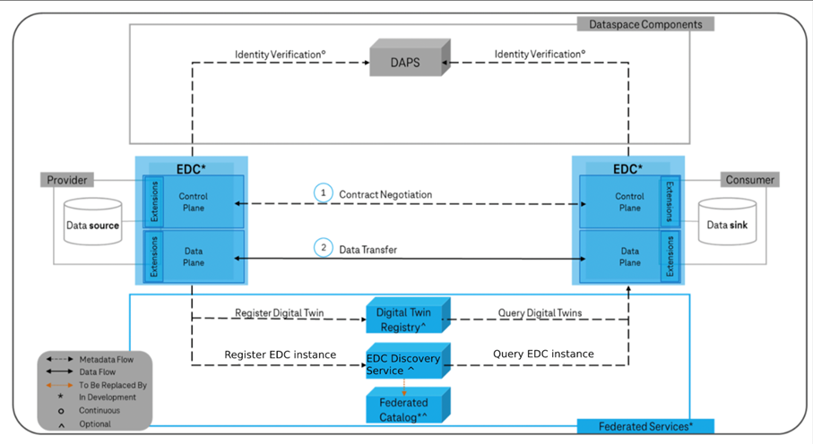
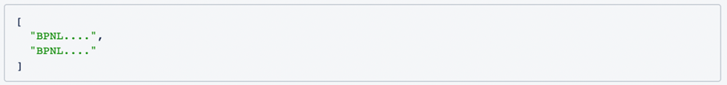

# CX - 0001 EDC Discovery API v.1.0.0

## Table of Contents

- [CX - 0001 EDC Discovery API v.1.0.0](#cx---0001-edc-discovery-api-v100)
  - [Table of Contents](#table-of-contents)
  - [ABOUT THIS DOCUMENT \& MOTIVATION](#about-this-document--motivation)
  - [DISCLAIMER \& LIABILITY](#disclaimer--liability)
  - [REVISIONS \& UPDATE](#revisions--update)
  - [COPYRIGHT \& TRADEMARKS](#copyright--trademarks)
  - [Introduction and Overview](#introduction-and-overview)
  - [1. Initial Situation](#1-initial-situation)
  - [2. Concideration and specifications](#2-concideration-and-specifications)
    - [2.1. Considerations](#21-considerations)
    - [2.2. Specification - the EDC Discovery Service in Action](#22-specification---the-edc-discovery-service-in-action)
  - [3. API of EDC Data Discovery Service](#3-api-of-edc-data-discovery-service)
    - [3.1. iNTERFACE](#31-interface)
    - [3.2. IMPLEMENTATION](#32-implementation)
    - [3.3. Out of scope entites and information](#33-out-of-scope-entites-and-information)
  - [4. Use Cases of using the EDC Discovery Service](#4-use-cases-of-using-the-edc-discovery-service)
  - [5. Related standards](#5-related-standards)

## ABOUT THIS DOCUMENT & MOTIVATION

## DISCLAIMER & LIABILITY

## REVISIONS & UPDATE

## COPYRIGHT & TRADEMARKS

## Introduction and Overview

The need to create data standards for the whole automotive value chain
and to encourage global data sharing is growing, but this is not just
due to the formation of new industry networks (like Catena-X). The
definition and introduction of a cross-industry standard for the
discovering of EDC instances is crucial for the networking of OEMs,
suppliers, consumers, and industrial partners to automatically look up
services and data. ***(Remark: The EDC is a separate component that is
needed to enable a sovereign data exchange. For more details about the
EDC, please refer to \[Standardization SC-002\]**)*

As the Catena-X network expands, a sizable amount of data assets will be
available via EDC connection technology. It could be difficult to
efficiently identify the proper EDC endpoint within the network. In
order to immediately find EDC instances throughout the network, a BPN
number inquiry will soon be required.

The following serves as the Platform Capability Data Discovery
Services\' technical documentation for the EDC Discovery Service. First,
the EDC Discovery Service\'s beginning condition is laid out,
highlighting the current problem with an efficient discovery. Next, the
relationships between other objects and the EDC Discovery Service are
laid up. The EDC Discovery API is then covered in detail in the
documentation with examples. Finally, use cases are highlighted for
using the EDC Discovery Service.

## 1. Initial Situation

Participants do not want their personal information made public. As a
result, these may only be searched indirectly, which necessitates
knowing or establishing who the data should be obtained from. Because no
one wants to examine every EDC instance (load of the net, latency
becomes ever larger with increasing number of participants, procedure
does not scale thus). As a result, the number of EDC instances requested
must be limited by suitable filters. As a result, subscribers must first
determine who may have the data depending on their specific
circumstances. This is performed by utilizing the EDC discovery service.
The BPN number is currently the only criterion provided for restricting
the EDC instances in question. (***Remark: The BPN is a unique,
unchangeable identifier for Business Partners. Internally, the EDC uses
the BPN \[Standardization BPM-001\] to query business partners**)*

In the future the resolution BPN -\> EDC instance might happen via the
Gaia-X Self Descriptions (SD), but this is not yet feasible with the
current version of the Gaia-X Trust Framework (v.22.04). As a result,
the SD cannot be used now, and the only way that remains available is
using the \"ServiceOffering" at this time. But that is not optimal yet,
especially for use cases involving decentralized Digital Twin
registration or Traceability use case. They require a service to
retrieve URL of EDC instances of interest related to a corporation
defined by its Business Partner Number (BPN), but there will also be
other cases when additional features could be needed to identify EDC
instances of interest. Especially for the Traceability use case, where
sometimes in the cause to identify a responsible EDC no BPN is provided.

Moreover, the GAIA-X Trustframework is still being developed. It is
possible to query for data services, particularly EDC instances, even
though not all necessary forms of Self Descriptions are described.
Therefore, we must use the EDC Discovery Service as a workaround until
the Trustframework of GAIA-X delivers all necessary Self Descriptions to
properly query for data assets.

The EDC Discovery Service API aims to offer a quick and automatic
approach of finding EDC instances and data services. As part of the EDC
instance discovery process, it is essential to ensure interoperability
with semantics and data sovereignty, compliance with GAIA-X and IDSA,
support for private descriptions and private data services that are not
visible to all participants, and the ability to find EDC instances for
use cases like traceability and decentralized digital twin registry
(DTR).

## 2. Concideration and specifications

### 2.1. Considerations

Sovereignty:

Participants do not want their information made public. As a result,
these may only be searched indirectly, which requires knowing or
figuring out from whom the data is to be obtained. Because one does not
want to ask about every EDC instance (load of the net, latency becomes
ever larger with increasing number of participants, procedure does not
scale thus). As a result, the quantity of requested EDC instances must
be constrained by appropriate filters. As a result, the subscribers must
first identify potential data owners from their settings. For this, the
EDC discovery service is employed. The BPN number is currently the only
criterion provided for restricting the EDC instances in question.

Performance:

We will have a significant amount of data assets accessible through EDC
connection technology as the Catena-X network grows. It may be
challenging to quickly locate the correct EDC endpoint inside the
network (without using broadcast or multicast). It will soon be
necessary to query EDC instances across the network by BPN number for
effective discoverability.

GAIA-X-Trustframework:

The GAIA-X-Trustframework is still in development. As long as not all of
the required categories of Self Descriptions are specified in order to
query for data services and, in particular, EDC instances. As a result,
until the GAIA-X Trustframework delivers all required Self Descriptions
to properly query for data assets, we must use the EDC Discovery Service
as a workaround.

Please note that we do not specify a standard, but rather a reference
implementation for the time being. This can be considered as a temporary
solution that will be superseded by the search interface of a future
GAIA-X Federated Catalog.

### 2.2. Specification - the EDC Discovery Service in Action

Figure 1 Main Components

The diagram above depicts a high-level overview of the EDC Discovery
Service workflow. Both connectors must be registered within an identity
provider, such as DAPS, which can register assets and expose them to a
metadata broker for other connectors to find. The consumer can then
obtain contract offers from the provider and begin contract
negotiations.

**The EDC Discovery Service:** During the onboarding process of EDC
instances, the instance will be registered at EDC Discovery Service.
This service can be requested to provide the link for EDC instances
queried by BPN number. Please note that in the future some other
attributes could be extended to support querying by other attributes as
well.

**Federated catalog:** The federated catalog is used by the provider to
offer their assets within the dataspace. The consumer uses the federated
catalog to search for available assets. Both the provider and consumer
use self-descriptions to list and search for assets in the federated
catalog, which are made publicly available. Digital twin registry. A
digital twin is the virtual representation of an asset.

**The Digital Twin Registry:** is used for a provider to register their
digital twins, as well as asset implementation and identifiers for a
digital twin. Additionally, consumers can search for these digital twins
and receive information about them and their endpoints.

## 3. API of EDC Data Discovery Service

### 3.1. iNTERFACE

The EDC / dataspace discovery interface is a CX network public available
endpoint which can get used to retrieve EDC endpoints and the related
BPNs, as well as search for endpoints via the BPN. Please note that EDC
API Version considered is 0.1.0

**To be provided attributes (Focus only on BPN for Release 2)**

- BPNL, or

- BPNS, or

- BPNA contains the complete data set (name and address).

Please note that in the future (i.e., starting from Release 3) some
other attributes could be extended to support querying by other
attributes as well.

### 3.2. IMPLEMENTATION

The EDC discovery endpoint can get triggered via technical as well as
real users, if relevant roles are available.

Please note that EDC API Version considered is 0.1.0

*Endpoint: POST: /api/administration/connectors/discovery*

**Request body**

The request body is expecting a list of BPNs for which the EDC endpoint
should get be fetched. Please add minimum one BPN.

**Response structure**

in case of an empty response, no EDC is found for the requested BPNs

### 3.3. Out of scope entites and information

The following entities or information are currently out of scope for the
EDC Discovery Service API

- Establishing a kind of name convention for artifacts of data/service
    offering to enable filtering of them. This might be investigated as
    Task of PI6, and is not available yet

- Service Discovery intends to query for offers using GAIA-X standards
    based on Self Descriptions.

## 4. Use Cases of using the EDC Discovery Service

The aim of Catena-X is to enable an EDC-integrated, decentralized
deployment of digital twin registries, keeping the data as close to the
data owners as feasible. One key component to achieving data sovereignty
is decentralization. Decentralized registries will be a feature of
future PIs, thus solutions and use cases must adapt. However, the
practicality of a decentralized solution must be proven via an End to
End scenario prior to starting a Catena-X global deployment. We intend
to concentrate more particularly on the following elements:

a.  Decentralized Registries require Digital Twins to be discovered in a
    three-step approach.

    i.  First find the EDCs of potential Digital Twin owners.

    ii. Second, query those EDCs for their Digital Twin Registry

    iii. Third discover the twin in that respective registry or
         registries.

b.  This will require some additional information to be added to a
    discovery request in addition to the UUID of a twin.

    i.  Best case: BPN of the owner of the Digital Twin is known and the
        query has only to be made to the EDCs of that BPN and
        subsequently to its Digital Twin Registries

    ii. Worst case:  Only knowing the UUID will result in a complete
        broadcast request to 275k+ members as per planning for each
        request as the UUID is non-structured
        and does not hold any information for any kind of segmentation.

## 5. Related standards

The following standards are related to or typically used by the EDC
Discovery Service API:

- CX - 0010 Business Partner Number

- CX - 0018 Eclipse Data Space Connector
